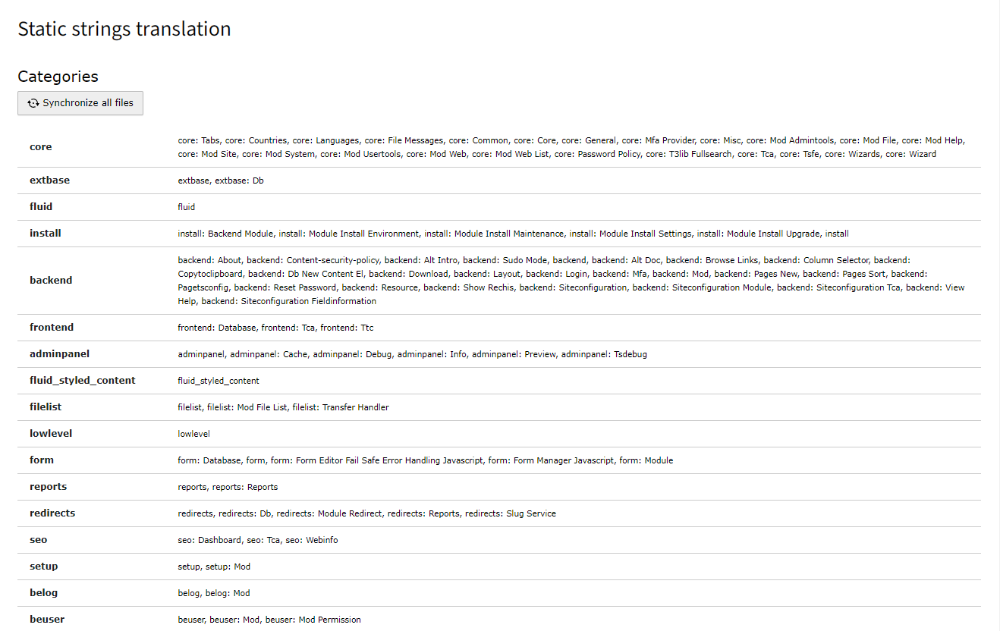
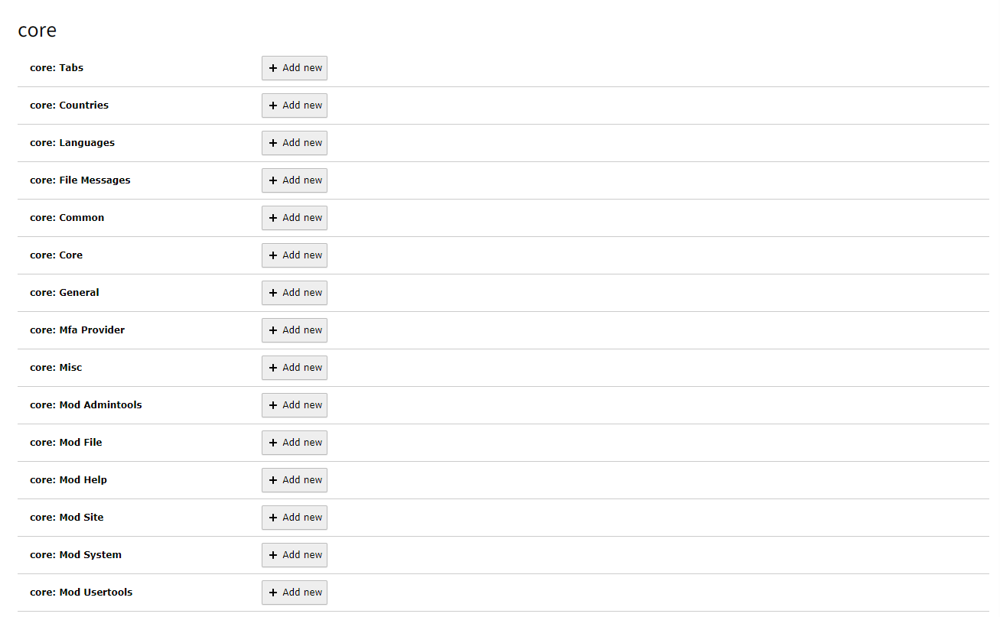
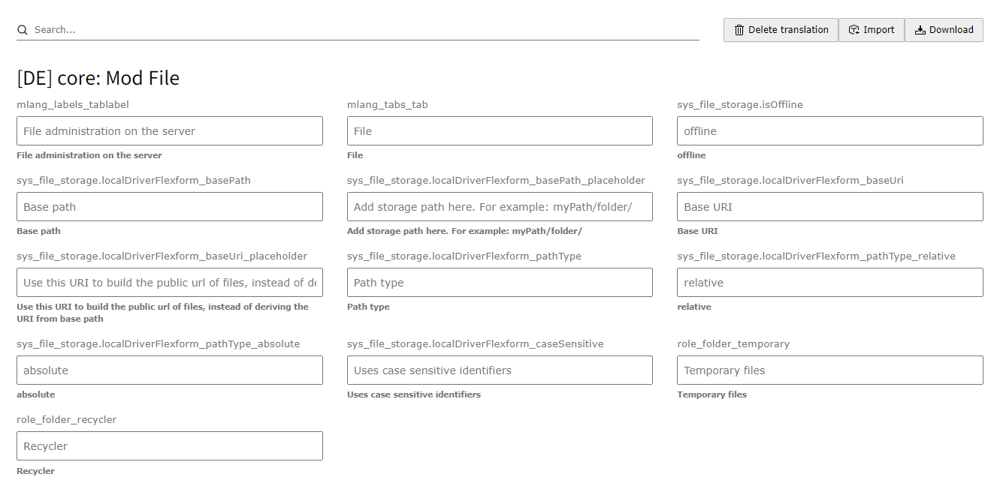

# Translator
TYPO3 extension for handling translations. It allows editors to edit static strings from XLF files (usually placed in *EXT:/Resources/Private/Languages*) or to export database entries, edit them over translation tool/agency in the xlf format and then import it again back to TYPO3.

## Changelog
[2.0.2](Documentation/Changelog/2.0.2.md)
[2.0.0](Documentation/Changelog/2.0.0.md)

## Initialization

Upon installation, a new submodule will be added under the WEB module. Before utilizing
the extension's features, it is essential to specify the location where new translations should be stored.
Follow these steps:

1. Navigate to the Extension Configuration section.
2. Look for the "Storage path (from the root of the project)" option within the HD Translator settings.
When inserting a relative path in this field, consider that starting point is the project root,
where your project's `composer.json` is stored.

## Static Strings Translations
### Previews
#### All locallang files categories


#### All locallangs for category


#### Example of german translation for one locallang


### Specific locallang files
A key feature of this extension lies in its ability to work seamlessly with `locallang.xlf` files. To enable the handling of specific `locallang.xlf` files, follow these steps:


1. Open the `ext_localconf.php` file in your TYPO3 extension.

2. Add the following configuration to register the desired `locallang.xlf` file (the unique_key must be always unique):

    ```php
    $GLOBALS['TYPO3_CONF_VARS']['translator']['unique_key'] = [
        'label' => 'My Cool Extension - Base',
        'path' => 'EXT:cool_extension/Resources/Private/Language/locallang.xlf',
        'category' => 'Cool Extension',
        'languages' => [
            'en',
            'de',
            'cs'
        ]
    ];
    ```
    - `label`: Provide a descriptive label for the set of translations.
    - `path`: Specify the path to the target `locallang.xlf` file within your extension.
    - `category`: Categorize the translations under a specific category.
    - `languages`: Define the supported languages for the translations.

Ensure that the provided path is correct and corresponds to the actual location of your `locallang.xlf` file. You can extend the 'languages' array to include additional language codes as required.

### Synchronizing All locallang.xlf Files

The system has the capability to retrieve all accessible `locallang.xlf` files across all extensions, making translation management more efficient. Follow these steps to synchronize the files:

1. In the extension configuration, locate and check the checkbox labeled "All locallang.xlf files."

2. Navigate to the Translator module within the TYPO3 backend.

3. Find the "Synchronize all files" button and click on it.

This action generates settings for all the `locallang.xlf` files, ensuring that the system is aware of and can handle translations from every extension. If you add a new translation file or introduce a new extension, it's essential to click the "Synchronize all files" button again. This process updates the system settings accordingly.

By utilizing this feature, you streamline the management of translations across your TYPO3 project, ensuring that the Translator module is aware of all relevant translation files and extensions.

### Correct Language Configuration

To define the correct language for your TYPO3 site, you can specify it within the site configuration file located at `config/sites/xxx/config.yaml`. Here's an example configuration:

```yaml
languages:
  -
    ...
    typo3Language: de
    ...
```

### Enable New Language not Supported by TYPO3

To enable a new language not supported by TYPO3, add the following code to either `LocalConfiguration.php` or `AdditionalConfiguration.php`. Ensure that this code appears before all extensions are loaded:

```php
$GLOBALS['TYPO3_CONF_VARS']['SYS']['localization']['locales']['user']['us'] = 'English US';
```

Important Components:
- 'us': This serves as the language key used in translation files.
- 'English US': Represents the name of the language.

### Translation Removal and Backup

When you remove a translation, the system automatically creates a backup of the deleted translation. If you attempt to create the same translation again, you will be prompted with an option to either restore the backup or generate a new translation from scratch.

## Database Export

The extension provides a flexible mechanism for exporting fields from the database, allowing you to tailor the exported data based on your needs.

### Default Export Settings

The default list of exported fields from the database is located in the same section as the "Show Fields" configuration. It follows the same "type" logic. If this setting is empty, all accessible non-TYPO3 core fields will be included in the export.

```php
$GLOBALS['TCA'][$table]['types'][1]['translator_export'] = 'title, subtitle, another_field';
```
#### Different Settings for Different Table Types

In many cases, you may find it necessary to have distinct settings for various content elements. For instance, you might want specific export configurations for a Content Element of type 'Header' as opposed to a 'Text' element. To achieve this level of granularity, utilize the type-specific settings. Here's an example for 'Header' and 'Text' elements within the `tt_content` table:

##### Header Content Element
```php
$GLOBALS['TCA']['tt_content']['types']['header']['translator_export'] = 'header, subheader';
```
##### Text Content Element
```php
$GLOBALS['TCA']['tt_content']['types']['text']['translator_export'] = 'header, subheader, bodytext';
```

#### Exporting Flexform Fields

When the Flexform is included in the export, it retrieves all fields by default. However, you can limit the exported fields similar to the entire table. Use the following configuration:

```php
$GLOBALS['TCA'][$table]['types'][1]['translator_export_column']['pi_flexform'] = 'settings.text, settings.header';
```

### Displaying Export Buttons

Export buttons will appear next to the save or edit buttons when editing a table entry or within the Page module. It's also a part of context menues.

Customize the export settings according to your specific requirements to ensure that only the necessary data is included in the exported file.

## Database Import

### Disable fields from possible update
This feature is useful when you want to avoid overwriting existing page slugs. During the import of database entries, the data is inserted into the database as usual. However, if you attempt to re-import the same table, the specified fields in the list will be skipped to prevent duplication or unintended changes.
```php
$GLOBALS['TCA']['pages']['types'][1]['translator_import_ignore'] = 'slug,url';
```
